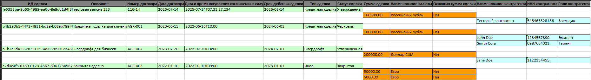

# Deal Service

Сервис для управления финансовыми сделками (договорами, суммами, контрагентами и их ролями), с поддержкой фильтров, сортировки, пагинации и экспорта в Excel.

---

## 📆 Функциональность

* ✅ CRUD для сущности `Сделка`
* ✅ Управление контрагентами и их ролями
* ✅ Поиск сделок с фильтрацией и пагинацией
* ✅ Изменение статуса сделки
* ✅ Экспорт в Excel (с цветом и группировкой)
* ✅ Логическое удаление `is_active`
* ✅ Liquibase для миграций

---

## 🚀 Технологии

| Стек              | Использовано     |
| ----------------- | ---------------- |
| Java              | 17+              |
| Spring Boot       | 3.x              |
| Spring Data JPA   | PostgreSQL       |
| Hibernate         | 6.x              |
| Liquibase         | Миграции базы    |
| Apache POI        | Экспорт в Excel  |
| Swagger (OpenAPI) | Документация API |
| Lombok            | Упрощение кода   |
| Maven             | Сборка проекта   |

---

## 📅 API Эндпоинты

### Сделки

| Method | URI                   | Description               |
| ------ | --------------------- | ------------------------- |
| PUT    | `/deal/save`          | Создать / обновить сделку |
| PATCH  | `/deal/change/status` | Изменить статус сделки    |
| GET    | `/deal/deal/{id}`     | Получить сделку по ID     |
| POST   | `/deal/search`        | Поиск с фильтрацией       |
| POST   | `/deal/search/export` | 📄 Экспорт в Excel        |

### Контрагенты

| Method | URI                            | Description            |
| ------ | ------------------------------ | ---------------------- |
| PUT    | `/deal-contractor/save`        | Сохранение контрагента |
| DELETE | `/deal-contractor/delete/{id}` | Логическое удаление    |

### Роли контрагентов

| Method | URI                          | Description               |
| ------ | ---------------------------- |---------------------------|
| POST   | `/contractor-to-role/add`    | Добавить роль контрагенту |
| DELETE | `/contractor-to-role/delete` | Логическое удаление       |

---

## 📄 Пример запроса на экспорт Excel

```json
POST /deal/search/export
Content-Type: application/json
Accept: application/vnd.openxmlformats-officedocument.spreadsheetml.sheet

{
  "page": 0,
  "size": 20,
  "sortBy": "agreementDate",
  "sortDirection": "DESC",
  "description": "кредит"
}
```

Результат: Excel-файл `.xlsx` с сделками.

---

## 📁 Liquibase

Миграции хранятся в:

```
src/main/resources/db/changelog/
```

---

## ⚠️ Обработка ошибок

```json
{
  "message": "Deal with id '...' not found",
  "timestamp": "2025-07-14T14:00:00"
}
```
---

## 💡 Старт локально с Docker

1. Создать `.env` в корне проекта:

```env
DB_NAME=deal-service-db
DB_USER=user
DB_PASSWORD=1
```
2. Старт:
```bash
docker compose up --build
```

---

## 👤 Автор

**Краковцев Артём**
